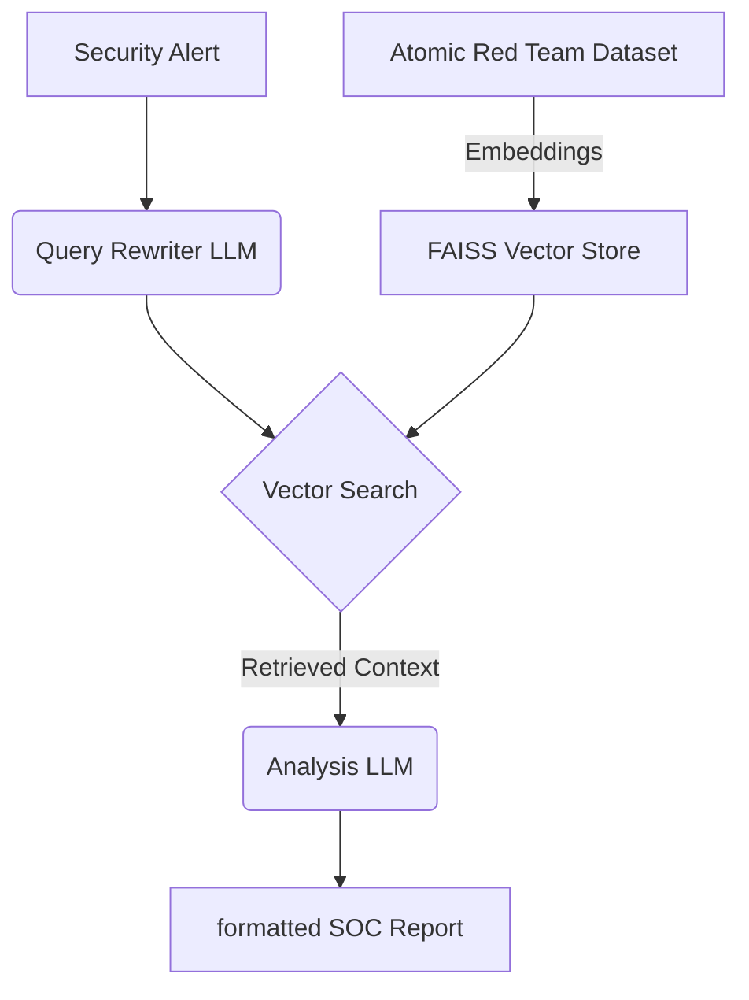

# CyberRAG 🛡️


**CyberRAG** is an AI-powered Security Operations Center (SOC) assistant that uses **Retrieval-Augmented Generation (RAG)** to analyze security alerts. It enhances Large Language Models (LLMs) with real-world attack data from the [Atomic Red Team](https://github.com/redcanaryco/atomic-red-team) dataset, enabling precise mapping to MITRE ATT&CK techniques.

## 🧠 Architecture



## ✨ Key Features

-   **Dual-LLM Pipeline**: Uses a dedicated LLM for query rewriting and a second high-performance LLM (Llama 3.3 70B) for analysis.
-   **MITRE ATT&CK Mapping**: Automatically maps vague alerts to specific T-Codes and techniques.
-   **Local Vector Store**: Uses FAISS for fast, private, and efficient similarity search on your local machine.
-   **IOC Extraction**: Automatically extracts Indicators of Compromise (IPs, Hashes) from raw logs.

## 🚀 Getting Started

### Prerequisites

-   Python 3.11 or higher
-   [Groq API Key](https://console.groq.com) (Free tier available)

### Installation

1.  **Clone the repository**
    ```bash
    git clone https://github.com/Startouf/CyberRAG.git
    cd CyberRAG
    ```

2.  **Install dependencies**
    ```bash
    pip install -r requirements.txt
    ```

3.  **Configure Environment**
    Create a `.env` file in the root directory:
    ```env
    GROQ_API_KEY=your_api_key_here
    ```

4.  **Build the Knowledge Base**
    Initialize the local vector store from the Atomic Red Team data:
    ```bash
    python ingest_atomics.py
    ```

### Usage

Start the interactive terminal:

```bash
python query_rag.py
```

**Example Query:**
> "I see a powershell script downloading a file from a temp directory. Is this suspicious?"

## 📂 Project Structure

-   `ingest_atomics.py`: Indexing script that converts YAML attack definitions into vector embeddings.
-   `query_rag.py`: Main application logic handling the user input, retrieval, and LLM generation.
-   `atomics/`: Directory containing the Atomic Red Team test definitions.

## ⚠️ Disclaimer

This tool is for **educational and defensive purposes only**. It uses the Atomic Red Team dataset to help security analysts understand attacks. Do not use this tool or its data for malicious purposes.
